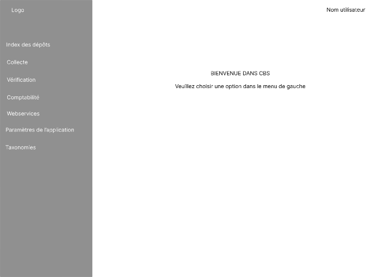

[<< écrans](./2-2-0-écrans.md)

### écran d'acceuil ### 

Ce premier écran nous propose un menu à gauche avec les différents accès : 

Du haut vers le bas : 
- [Index des dépôts](./2-2-2-index-dépôts.md)
- [Collecte](./2-2-3-gestion-collecte.md)
- [Vérification](./2-2-4-vérification-données.md)
- [Comptabilité](./2-2-5-comptabilité.md)
- [Webservices](./2-2-6-webservices.md)
- [Paramètres de l'application](./2-2-7-paramètres-application.md)
- [Taxonomies](./2-2-8-taxonomies.md)

En fonction des différents rôles des employés l'écran d'acceuil sera limité à ce dont ils ont besoin :
- L'équipe de la collecte : Index des dépôts et Collecte ;
- L'équipe de la validation : Index des dépôts et Vérification ;
- La comptabilité : Index des dépôts et Comptabilité ;
- Le helpdesk : Index des dépôts, Collecte et Webservices ;
- Le service support : tous les écrans.

---

[>> index des dépôts](2-2-2-index-dépôts.md)