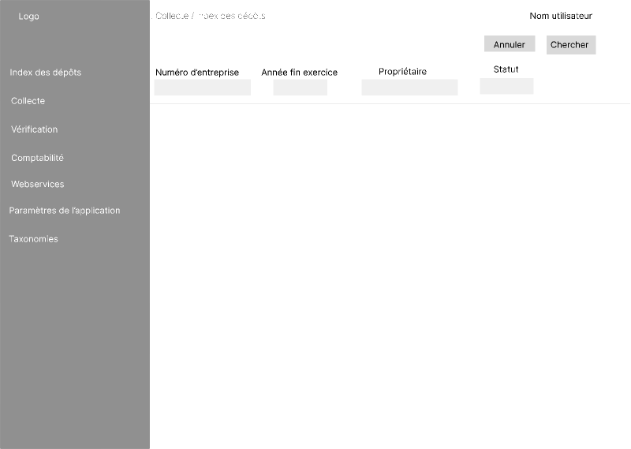

[<< acceuil](2-2-1-acceuil.md)

## Index des dépôts ##

Cet écran permet aux utilisateurs d'effectuer des recherches sur base de différents critères : 

Les quatres premiers points seront les paramètres de base affichés à l'écran : 
- Numéro d'entreprise ;
- Date de fin d'exercice (Année fin exercice) ;
- Nom du déposant (Propriétaire) ;
- Statut.

Les points suivants sont des paramètres supplémentaires qui permettront d'affiner encore plus les recherches. Ils sont accessibles via le menu déroulant ("Plus") : 
- Date de début d'exercice (de) ;
- Date de début d'exercice (à) ;
- Date de fin d'exercice (de) ;
- Date de fin d'exercice (à) ;
- Date de dépôt (de) ;
- Date de dépôt (à) ;
- Type de modèle ;
- Référence ;
- Date ultime de paiement (de) ;
- Date ultime de paiement (à) ;
- Référence de paiement ;

En haut à droite, le nom de l'utilisateur est indiqué avec un choix de langue et il y a également un bouton "Chercher" et "Annuler".

---

[>> gestion de la collecte](2-2-3-gestion-collecte.md)