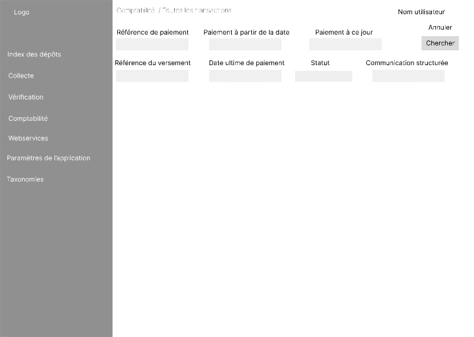

[<< Vérification des données](2-2-4-vérification-données.md)

## Comptabilité ##

Cet écran nous permet de choisir entre 4 écrans : 

1) Toutes les transactions :
Dans le haut de cet écran, il y a des paramètres de recherche par défaut :
    - Référence de paiement ;
    - Création d'opérations de paiement (de) ;
    - Création d'opérations de paiement (à) ;
    - Paiement à partir de ;
    - Paiement jusqu'à ;
    - Référence du paiement ;
    - Date ultime de paiement (de) ;
    - Date ultime de paiement (à) ;
    - Statut ;
    - Communication structurée. 

Suivi d'un bouton "Recherche" et d'un bouton "Annuler".

2) Tous les versements : 
Ecran avec les paramètres de recherche suivants :
    - Période (de) ;
    - Période (à) ;
    - Type de carte. 

Suivi d'un bouton "Recherche" et d'un bouton "Annuler".

3) Paiements en erreur : (par défaut 20 éléments sont affichés par page, possibilité de diminuer ou d'augmenter cet affichage).
En haut de page, un compteur total des éléments repris dans cette liste. 
Ensuite, présentation sous forme d'un tableau à plusieurs colonnes :  
    - Code erreur ;
    - Référence du paiement ;
    - Date de création ; 
    - Date du statut ; 
    - Statut ;
    - Montant ;
    - Date de paiement ; 
    - Statut de l'erreur. 

4) Remboursements : 
Ecran avec les paramètres de recherche suivants :
    - Date création en BCA (de) ;
    - Date création en BCA (à) ;
    - Statut ;
    - Référence du paiement. 

Suivi d'un bouton "Recherche" et d'un bouton "Annuler" et d'un tableau à plusieurs colonnes : 
- Référence remboursement ;
- Montant du remboursement ;
- Statut ; 
- Raison de l'erreur ;
- Référence du paiement ;
- Montant du paiement ;
- Type de carte ;
- Créé le ;
- Créé par ;
- Confirmé le ;
- Confirmé par. 

Par défaut 20 éléments sont affichés par page, possibilité de diminuer ou d'augmenter cet affichage.

---

[>> Webservices](2-2-6-webservices.md)