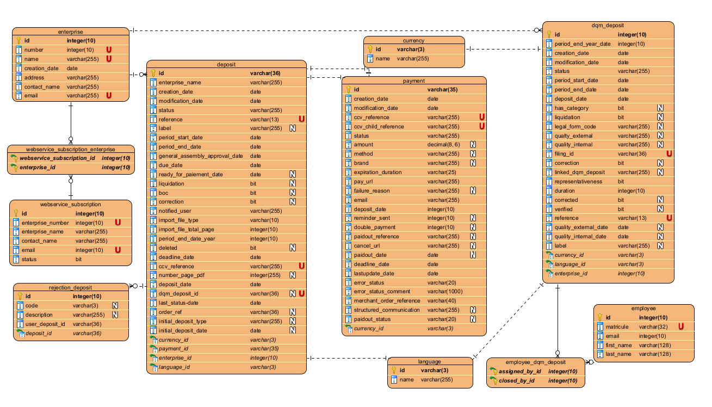

[<< Backlog](3-0-backlog.md)

## Database ##

Le modèle de database décrit le schéma de la base de données utilisée pour l'application.

La table **dqm_deposit** contient les informations en rapport avec un dépôt donné qui se trouve en vérification : 
- son ID ;
- le numéro d'entreprise ; 
- l'année de la période comptable ;
- la date de création ; 
- la date de modification ; 
- le statut ; 
- la date de début ;
- la date de fin ; 
- la date de dépôt ;
- a une categorie ;
- est en liquidation ; 
- le code de la forme légale ;
- le drapeau de qualité externe ;
- le drapeau de qualité interne ;
- l'ID de Filing ;
- est un rectificatif ;
- lien du dépôt en dqm ;
- représentativité ; 
- la durée ;
- corrigé ; 
- vérifié ;
- référence ; 
- date du drapeau externe ;
- date du drapeau interne ;
- label ;
- devise.

La table **entreprise** reprend les informations d'une société : 
- son ID ;
- son numéro (TVA) ;
- son nom ;
- sa date de création ; 
- son adresse ; 
- la personne de contact ;
- l'email de contact. 

La table **user_deposit** reprend les informations d'un dépôt au moment de sa création dans l'application. 

La table **payment** reprend les informations de paiement d'un dépôt dès que celui-ci a été soumis et quelque soit le statut du paiement par la suite (accepté, rejeté, refusé).

La table **currency** reprend toutes les devises existantes et pouvant être utilisées pour un dépôt. 

La table **rejection** reprend tous les codes de refus d'un dépôt. 

La table **webservices_subscription** reprend toutes les souscriptions au webservices (actives ou inactives).

La table **employee** reprend les informations d'un employé de la Banque Nationale. 

La table **langue** reprend toutes les langues existantes et pouvant être utilisées pour u dépôt. 

---

[>> Entity](5-0-entity.md) 